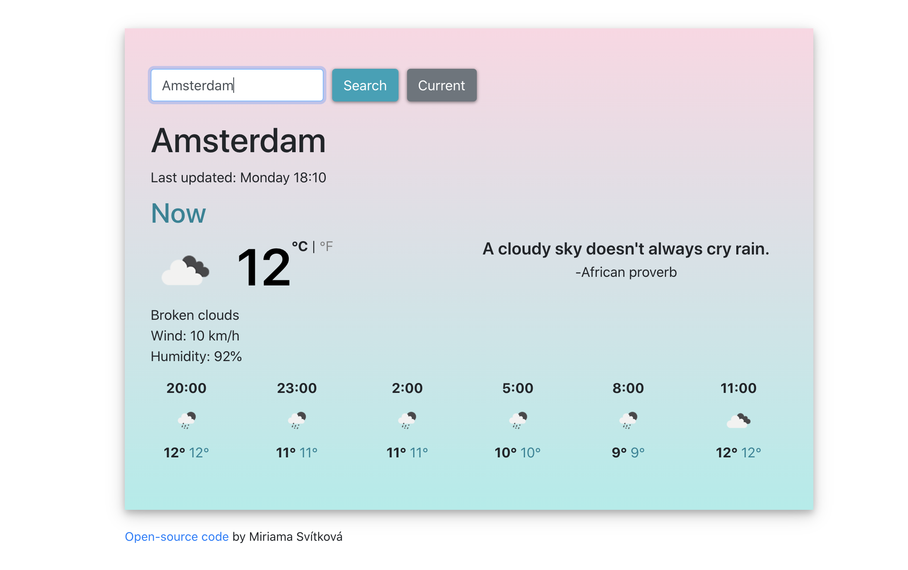

# React Weather App

This is my final project from [SheCodes Front End Development Bootcamp](https://www.shecodes.io/students/113-miriama-svitkova).

## Table of contents

- [Overview](#overview)
  - [The challenge](#the-challenge)
  - [Screenshot](#screenshot)
  - [Links](#links)
- [My process](#my-process)
  - [Built with](#built-with)
  - [Continued development](#continued-development)
- [Author](#author)

## Overview

### The challenge

Users should be able to:

- Search for any city and see the current weather and a 12-hour forecast
- Have the weather displayed for their current location
- Switch between °C and °F
- See a proverb related to the current weather

### Screenshot

### Links

- [Live Site URL](https://jolly-sinoussi-6463fc.netlify.app/)

## My process

### Built with

- Bootstrap
- axios
- [OpenWeatherMap API](https://openweathermap.org/api)

### Continued development

Future improvements:

- styled-components/Chakra UI
- TypeScript
- reorganize files
- testing

## Author

- LinkedIn - [Miriama Svítková](https://www.linkedin.com/in/miriama-svitkova)
